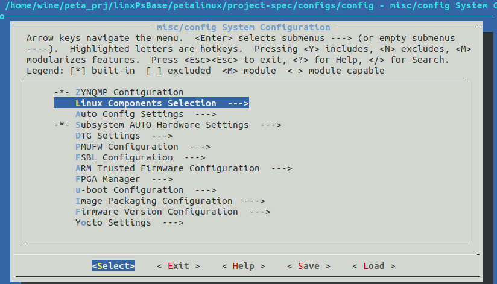
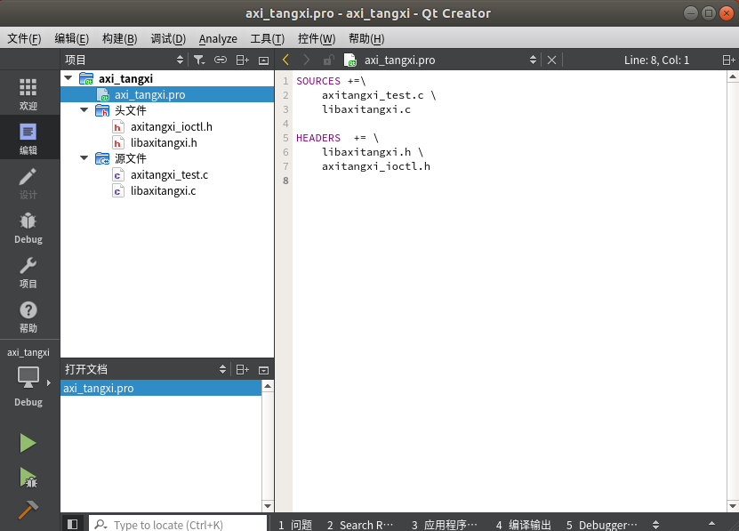
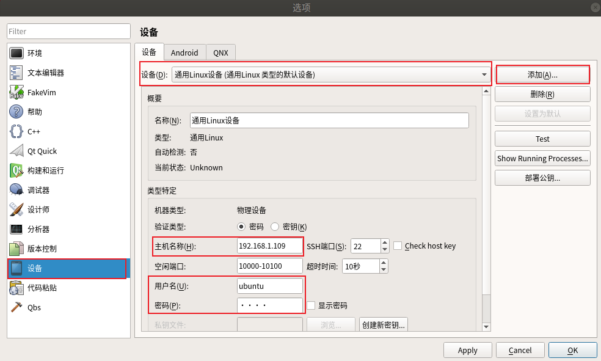

<!-- markdownlint-disable-file -->

# 基于linux系统上与tangxi芯片通信的AXI驱动

## 概要

### 背景

适配于重点研发项目tangxi芯片的通信与控制模块，适配于PL FPGA端的脉动阵列/变换网络的通信与控制模块

### 主要特点

- 突发发送ARM/PS端的数据至tangxi芯片相应的node
- 突发发送PS DRAM的数据至PL端DRAM
- 通过ARM获取、控制tangxi芯片工作状态
- 通过ARM获取、控制PL端的脉动阵列/变换网络
- 传输至tangxi芯片带宽达700MB/s

## 设置驱动

### 环境

- `vivado:`vivado2020.1
- `linux:` ubuntu18.04，petalinux2020.1
- `开发板：` Zynq UltraScale+ MPSoCs AXU7EV, XCZU7EV-2FFVC1156I

### Linux内核

- 设置petalinux环境变量

```
source /opt/pkg/petalinux/settings.sh
```

- 创建petalinux工程

```
cd ~/peta_prj/linxPsBase

petalinux-create -t project -n petalinux --template zynqMP
```

- 配置petalinux工程的硬件信息

```
cd ~/peta_prj/linxPsBase/petalinux

petalinux-config --get-hw-description ../hardware/
```

出现配置界面



- 配置本地u-boot和内核 (内核版本是5.4.0)

1. 从github下载适配petalinux版本的[u-boot](https://github.com/Xilinx/u-boot-xlnx/tree/xlnx_rebase_v2020.01)与[内核](https://github.com/Xilinx/linux-xlnx/tree/xlnx_rebase_v5.4)

2. `配置u-boot：` 选择 Linux Components Selection -->  u-boot  --> ext-local-src  -->  External u-boot local source settings  --> 配置u-boot的绝对路径

3. `配置内核：` 选择Linux Components Selection -->  linux-kernel  --> ext-local-src  -->  External linux-kernel local source settings  --> 配置内核的绝对路径

4. 配置Auto Config Settings -->  选中kernel autoconfig + u-boot autoconfig

5. save --> exit

- 设置离线编译（如果不设置，petalinux-build时间很长）

1. 下载 (文件较大，需预留60GB以上空间)：[xilinx官网下载petalinux2020.1](https://www.xilinx.com/support/download/index.html/content/xilinx/en/downloadNav/embedded-design-tools/archive.html)对应的包：sstate_aarch64_2020.1、downloads_2020.1

2. 配置：

```
petalinux-config
```

出现配置界面，选择Yocto Settings --> 关闭 Enable Network sstate feeds --> Local sstate feeds settings --> 配置sstate文件中的aarch64的绝对路径 exit --> Add pre-mirror url --> 删除原先默认的网址，配置downloads_2020.1/downloads的绝对路径（注意：路径前面加  file://  + 路径）exit save exit

### 设备树

1. 系统生成的DMA设备树：~/peta_prj/linxPsBase/petalinux/components/plnx_workspace/device-tree/device-tree/ 设备树文件：pcw.dtsi pl.dtsi system-conf.dtsi system-top.dts zynqmp.dtsi zynqmp-clk-ccf.dtsi

其中pl.dtsi内容：

```
/ {
	amba_pl: amba_pl@0 {
		#address-cells = <2>;
		#size-cells = <2>;
		compatible = "simple-bus";
		ranges ;
		TX_AXI_IF_IP_0: TX_AXI_IF_IP@80000000 {
			clock-names = "clk";
			clocks = <&zynqmp_clk 71>;
			compatible = "xlnx,TX-AXI-IF-IP-1.0";
			interrupt-names = "TangXi_irq";
			interrupt-parent = <&gic>;
			interrupts = <0 89 4>;
			reg = <0x0 0x80000000 0x0 0x10000>;
		};
	};
};
```

2. 自定义设备树

路径：~/peta_prj/linxPsBase/petalinux/project-spec/meta-user/recipes-bsp/device-tree/files/

system-user.dtsi:

```
/include/ "system-conf.dtsi"
/ {
};

/* SD */
&sdhci1 {
	disable-wp;
	no-1-8-v;
};


/* USB */
&dwc3_0 {
	status = "okay";
	dr_mode = "host";
};

&amba_pl {
	#address-cells = <2>;
	#size-cells = <2>;
	axi_tangxi: axi_tangxi@80000000 {
		compatible = "xlnx,axi-tangxi";
		interrupt-names = "axitangxi_irq";
		interrupt-parent = <&gic>;
		interrupts = <0 89 4>;
		reg = <0x0 0x80000000 0x0 0x10000>;
	};
};
```

`注意：`

- 根据自己的开发板，修改设备树满足Linux运行基本条件，如这里的SD卡和USB；
- 大致配置需要和pl.dtsi一致，只修改自己需要配置的部分

### 设置文件系统

petalinux配置可以生成默认的文件系统，但是通过配置其他文件系统可以安装其他发行版本的系统，如ubuntu，此处为了在板子上运行ros系统，故在板子上安装ubuntu文件系统

具体详见zynq安装ubuntu文件系统

## 编译驱动

1. 使用petalinux构建模块：

```
petalinux-create -t modules --name axi-tangxi --enable
```

2. 添加驱动源码
   将driver/全部文件，与include/axitangxi_ioctl.h文件放入~/peta_prj/linxPsBase/petalinux/project-spec/meta-user/recipes-modules/axi-tangxi/files/文件夹中

修改Makefile文件：

```
DRIVER_NAME = axi-tangxi
$(DRIVER_NAME)-objs = axi_tangxi.o axitangxi_dev.o
obj-m := $(DRIVER_NAME).o

MY_CFLAGS += -g -DDEBUG
ccflags-y += ${MY_CFLAGS}

SRC := $(shell pwd)

all:
	$(MAKE) -C $(KERNEL_SRC) M=$(SRC)

modules_install:
	$(MAKE) -C $(KERNEL_SRC) M=$(SRC) modules_install

clean:
	rm -f *.o *~ core .depend .*.cmd *.ko *.mod.c
	rm -f Module.markers Module.symvers modules.order
	rm -rf .tmp_versions Modules.symvers
```

修改上一层文件夹的axi-tangxi.bb文件：

```
SUMMARY = "Recipe for  build an external axi-tangxi Linux kernel module"
SECTION = "PETALINUX/modules"
LICENSE = "GPLv2"
LIC_FILES_CHKSUM = "file://COPYING;md5=12f884d2ae1ff87c09e5b7ccc2c4ca7e"

inherit module

INHIBIT_PACKAGE_STRIP = "1"

SRC_URI = "file://Makefile \
           file://axi_tangxi.c \
           file://axitangxi_dev.c \
           file://axitangxi_dev.h \
           file://axitangxi_ioctl.h \
	   file://COPYING \
          "

S = "${WORKDIR}"

# The inherit of module.bbclass will automatically name module packages with
# "kernel-module-" prefix as required by the oe-core build environment.
```

3. 编译驱动模块 (每次修改驱动需编译)

```
petalinux-build -c axi-tangxi
```

在/petalinux/项目中搜索`axi-tangxi.ko`文件，这个文件就是需要加载入linux系统的axi-tangxi驱动

将这个文件放入NFS共享目录中，或者sd卡文件系统中，稍后测试时进行加载

## 基于Qt交叉编译应用程序

1. 安装Qt交叉编译环境，详见安装Qt交叉编译环境

2. Qt交叉编译应用程序

- 新建Application，将include/所有文件放置头文件，examples/与lib/文件夹放入源文件



- axi_tangxi.pro

```
SOURCES +=\
    axitangxi_test.c \
    libaxitangxi.c

HEADERS  += \
    libaxitangxi.h \
    axitangxi_ioctl.h
```

- 构建项目

构建项目，会在同级目录生成`build-axi_tangxi-zynqMP-Debug` 文件夹，找到其中`axi_tangxi`文件，该文件可以在板级直接运行

- 远程实时debug

1. 首先需要启动PC端的NFC文件共享，见教程；

2. 添加远程设备，将网口接入开发板，配置域名为同一域，然后配置设备连接参数



如上述方式无法连接，使用gdbserver来实时调试：

在qt“构建和运行”界面，选择“Debuggers”，新建一个名为“ZYNQ_GDB”的调试器。在这里不是选择petalinux-v2020.1自带调试器(petalinux安装路径/tools/linux-i386/gcc-arm-linux-gnueabi/bin/arm-linux-gnueabihf-gdb)​。如果选择该调试器的话，在进行远程调试的时候会产生错误。这里应该选择gdb-multiarch调试器。
安装gdb-multiarch调试器，在命令终端运行

```
sudo apt-get install gdb-multiarch​
```

PC端的ubuntu系统安装gdb-multiarch调试器，默认安装的目录为/usr/bin/gdb-multiarch​。
ZYNQ_GDB调试器路径即选择/usr/bin/gdb-multiarch​。

目标板的IP：192.168.1.109
PC端的IP：192.168.1.108

使用NFC共享目录：192.168.1.108:/home/wine/work/ 为PC端目录,将构建好的axi_tangxi与之前生成的axi-tangxi.ko驱动文件放入，在/opt/petalinux/2020.1/sysroots/aarch64-xilinx-linux/文件目录下搜索gdbserver,将搜索到的gdbserver可执行文件一起拷贝到上述PC nfc共享目录中

/home/ubuntu/nfs为开发板目录会同步看到该文件，在开发板端使用以下命令

```
sudo ifconfig eth0 192.168.1.109

sudo mount -t nfs 192.168.1.108:/home/wine/work/ /home/ubuntu/nfs

cd /home/ubuntu/nfs
sudo insmod axi-tangxi.ko

//使用gdbserver连接
sudo gdbserver 192.168.1.109:11 axi_tangxi
```

就可以逐步远程debug

## 板级调试

设置好板级Linux系统，这边使用的是ubuntu20.04 LTS版本的文件系统

需要文件：

驱动文件：axi-tangxi.ko (编译驱动生成的文件)
应用文件：axi_tangxi (应用程序交叉编译的可执行文件)

调用驱动之前需要加载驱动（可以根据需求设置自启动加载）

```
insmod axi-tangxi.ko
```

在系统生成 /dev/axi_tangxi 文件设备，可以通过 `dmesg` 查看内核打印信息：

```
dmesg | tail -20
```

查看中断信息：

```
cat /proc/interrupts
```

如果有axi_tangxi的中断信息，即中断与设备均加载完成，即可运行：

```
./axi_tangxi
```

卸载设备

```
rmmod axi_tangxi
```

## Notice

- 定制化用于tangxi芯片，如果使用其他模型或结构需要自定义函数与功能

- rmmod卸载设备之后，再次重新insmod加载设备，可能会导致中断注册失败的问题（尚未解决），需要重新启动开发板insmod才可以正常注册

- 目前axitangxi_malloc函数只能一次性分配最大`4MB`的数据，后续待优化

## License (USTC-IAI)

written by `wangyang` on 2023.9 v1.0.
